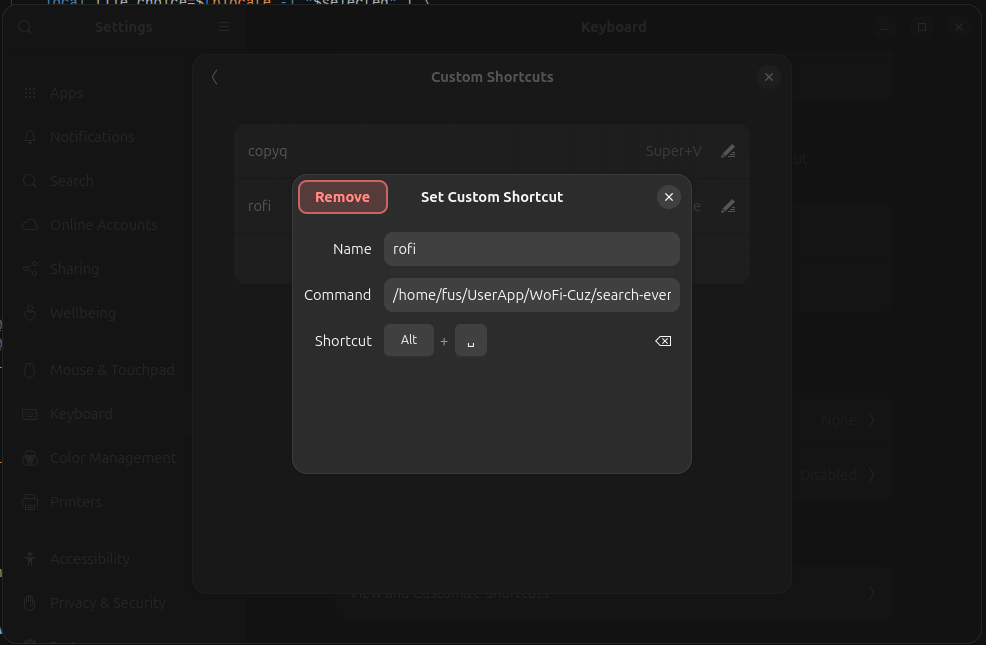

# 1. Introduction to FlowLauncher-like Script for Wo-Fi

The provided script is a versatile search and application launcher written in Zsh, optimized for Linux systems running Wayland (via Wofi).

Key features include:

- Unified Case-Insensitive Search: Combines simultaneous searches for Desktop applications (.desktop), prominent binaries, and deep system-wide files.
- Smart Workflow (Layered): Displays the application list in the initial interface. If the user enters a keyword not found in the available app list, the script automatically transitions to searching files via plocate in the Root scope, automatically excluding unnecessary system/cache directories to boost speed.
- Automated Routing and Execution: Automatically detects and opens applications using gtk-launch, runs binaries with nohup, or opens any file with the system's default application via xdg-open.


# 2. Install Prerequisites

For the script to run smoothly, your system needs certain foundational tools. Open your terminal and run the command corresponding to your Linux distribution:

```Bash
sudo apt install zsh plocate xdg-utils libgtk-3-bin
```

# 3. Install Wofi 

```Bash
sudo apt install wofi
```

# 4. Custom CSS

In the code, the script calls the interface style from `$HOME/.config/wofi/style.css`. You need to create this file to make Wofi look better.

Create the directory and CSS file:

```
mkdir -p ~/.config/wofi
nano ~/.config/wofi/style.css
```

You can paste the following basic Dark Mode CSS into the [style.css](./theme-config.css) file (you can freely modify the colors and dimensions later):

```CSS
window {
    margin: 5px;
    border: 2px solid #89b4fa;
    background-color: #1e1e2e;
    border-radius: 8px;
    font-family: monospace;
    font-size: 14px;
}
#input {
    margin: 10px;
    border: none;
    background-color: #313244;
    color: #cdd6f4;
    padding: 8px;
    border-radius: 5px;
}
#inner-box {
    background-color: #1e1e2e;
}
#outer-box {
    margin: 5px;
    padding: 10px;
    background-color: #1e1e2e;
}
#text {
    margin: 2px;
    color: #cdd6f4;
}
#entry:selected {
    background-color: #89b4fa;
    border-radius: 5px;
}
#text:selected {
    color: #11111b;
    font-weight: bold;
}
```

# 5. Custom Wofi 

To use Ultra Flow-search as a daily tool, save it as a globally executable command in your system:

## Step 1: Create a new script file (e.g., name it wofi-compose):

```Bash
mkdir -p ~/.local/bin
nano ~/.local/bin/ultra-search
```

## Step 2: Paste the entire Zsh code you provided into this file and save it.

Ref: [link](./wofi-compose.sh)

```Bash
#!/bin/zsh

# @brief Ultra Flow-search: Root scope, case-insensitive, enhanced App/Bin detection
# @return void
flow_pretty_search() {
    # Define app and binary directories
    local desktop_dirs=("/usr/share/applications" "$HOME/.local/share/applications")
    
    # Fetch names from desktop files and bins
    local names=$(grep -rih "^Name=" "${desktop_dirs[@]}" 2>/dev/null | cut -d'=' -f2- | sort -f -u)
    local bins=$(ls /usr/bin | grep -Ei "^(code|vlc|chrome|firefox|steam|discord|obs|snapshot|cheese)")

    # Combine list and add UI prefix
    local apps_list=$(echo -e "$names\n$bins" | sort -f -u | sed 's/^/> /')

    # Launch main UI window with wofi case-insensitive flag (-i)
    local selected=$(echo "$apps_list" | wofi -i --dmenu --normal-window \
        --style "$HOME/.config/wofi/style.css" \
        --prompt "Search Everything (Case-Insensitive)..." \
        --width 600 --height 400)

    # Exit if no selection is made
    if [ -z "$selected" ]; then {
        return
    }
    fi

    # Handle App launch or file fallback
    if [[ "$selected" == "> "* ]]; then {
        local query="${selected#"> "}"

        # Exact match for desktop file case-insensitively
        local desktop_path=$(grep -ril "^Name=$query$" "${desktop_dirs[@]}" 2>/dev/null | head -n 1)

        # Launch desktop app
        if [ -n "$desktop_path" ]; then {
            gtk-launch "$(basename "$desktop_path")"
        }
        else {
            # Check if it is a binary command
            local binary_cmd=$(ls /usr/bin | grep -ix "$query" | head -n 1)
            
            # Launch binary or fallback to xdg-open
            if [ -n "$binary_cmd" ]; then {
                nohup "$binary_cmd" >/dev/null 2>&1 &
            }
            else {
                xdg-open "$query"
            }
            fi
        }
        fi
    }
    else {
        # Deep search in root scope with case-insensitive plocate (-i), grep (-viE), and wofi (-i)
        local file_choice=$(plocate -i "$selected" | \
            grep -viE "/(\.git|\.cache|\.local|proc|sys|dev|run|snap|var/lib/docker)/" | \
            head -n 1000 | \
            wofi -i --dmenu --normal-window \
            --style "$HOME/.config/wofi/style.css" \
            --prompt "Root Files: $selected" \
            --width 900 --height 600)

        # Open selected file
        if [ -n "$file_choice" ]; then {
            xdg-open "$file_choice"
        }
        fi
    }
    fi
}

# @brief Entry point of the script
# @return void
main() {
    # Initiate flow search
    flow_pretty_search
}

main
```

## Step 3: Grant execution permissions to the file:

```Bash
chmod +x ~/.local/bin/wofi-compose.sh
```

# Add to `Keyboard-Shortcut`



# Demo

